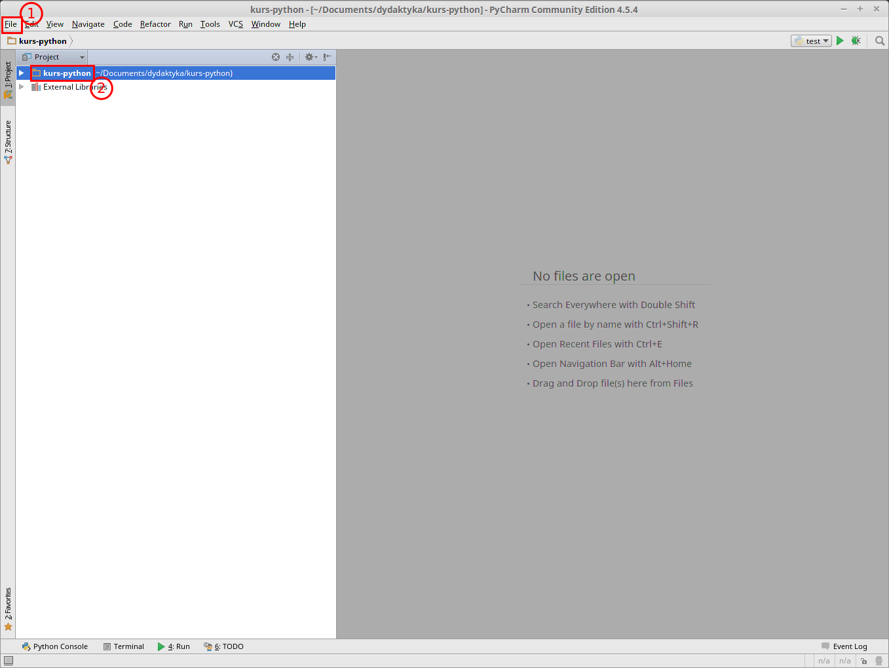
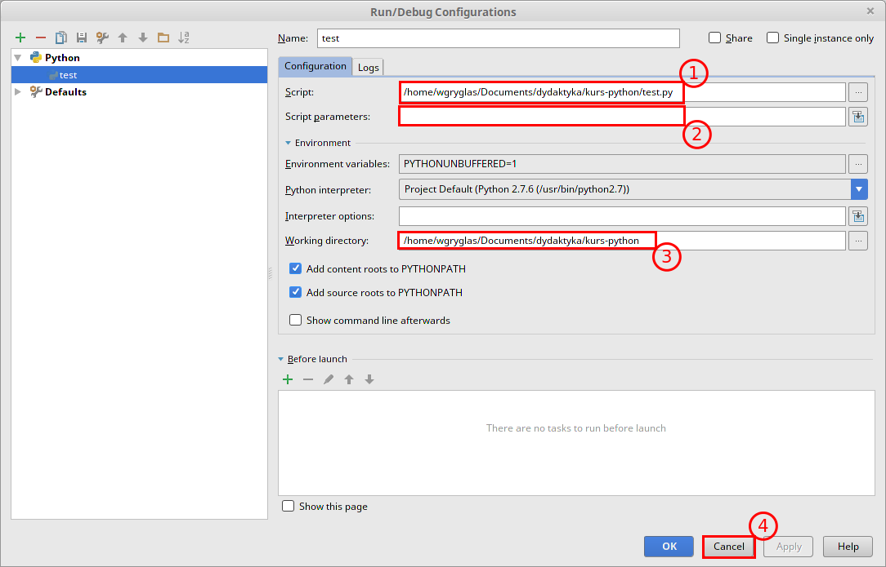
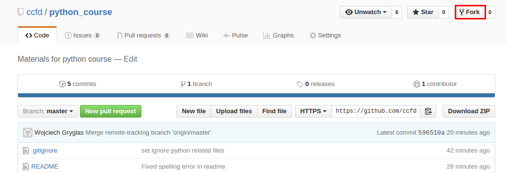
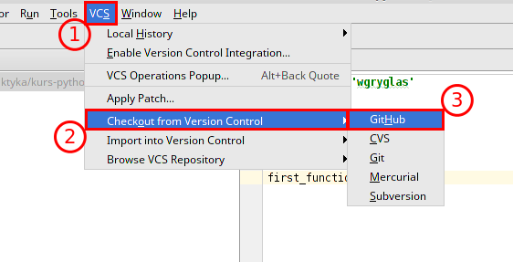
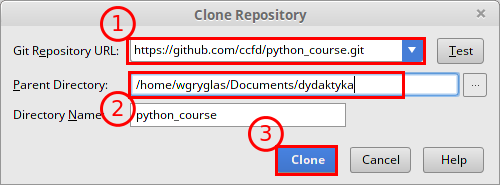
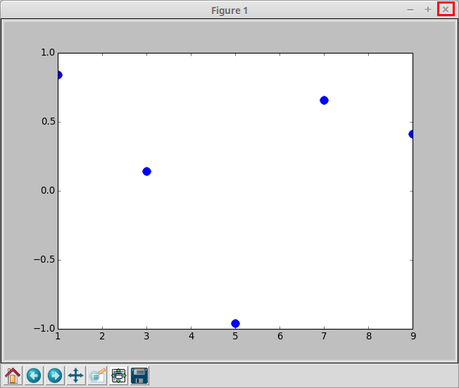
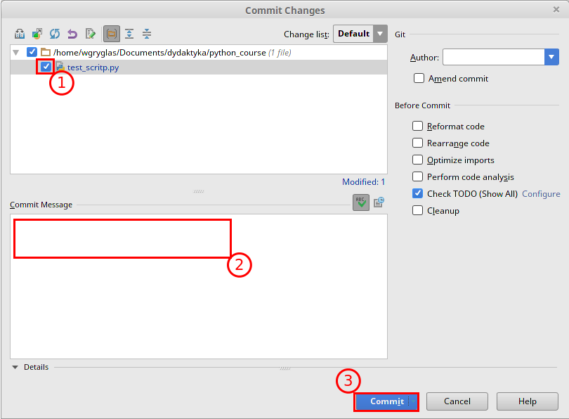
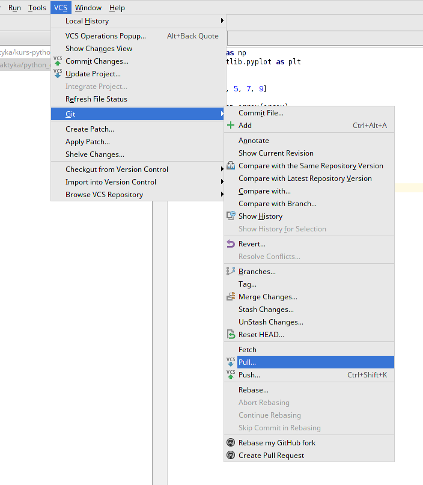

# Wymagania

- minimalna znajomość systemów z rodziny Linux,
- podstawowa znajomość programowania (język nie ma znaczenia).

# System operacyjny
Zalecane jest korzystanie z systemów z rodziny Linux, a w szczególności opartych na Debianie. Jednak pakiety pythona są przygotowane do instalacji również na systemy z rodziny Windows (instalacja dodatkowych pakietów za pomocą *pip*, o którym w dalszej części). W związku z tym istnieje możliwość pracy na takim systemie, jednak będzie się to wiązało z ograniczonym wsparciem prowadzących kurs.

# Kontrola wersji - git i GitHub
Narzędzia kontroli wersji są praktycznie niezbędne podczas pracy nad większym kodem, a przede wszystkim w sytuacji gdy nad jednym projektem współpracuje więcej osób. Pozwalają one na:

- śledzenie kolejnych zmian w kodzie, 
- usuwanie niepotrzebnych zmian, 
- tworzenie "podprojektów" w których pracuje się tylko nad częścią nowego kodu, 
- łączenie kodu różnych osób w obrębie nawet tego samego pliku.

Więcej informacji o tym czym właściwie jest kontrola wersji można przeczytać pod linkiem [git - wprowadzenie do kontroli wersji](https://git-scm.com/book/pl/v1/Pierwsze-kroki-Wprowadzenie-do-kontroli-wersji). W przypadku naszego kursu do kontroli wersji będziemy stosowali narzędzie zwane *git*, które zostało opracowane przez "ojca" systemów Linux Linusa Torwaldsa. Wielu programistów obsługuje go z poziomu konsoli. My jednak skupimy się tylko na podstawowych jego funkcjach i będziemy z gita korzystali tylko z poziomu środowiska programistycznego, o którym więcej powiemy dalej. Na poziomie naszego kursu system ten posłuży do pobierania materiałów oraz przechowywania własnych wersji rozwiązań zadań. Dzięki temu uczestnicy poznają podstawowe sposoby korzystania z gita.  

W ramach przygotowania do zajęć należy przejść na stronę [GitHub](https://github.com/) i zarejestrować własne konto w tym serwisie. Dzięki temu otrzymamy pewną darmową (wersja darmowa wymaga publicznego dostępu do zamieszczonego kodu) przestrzeń dyskową na której będziemy mogli przechowywać wszystkie niezbędne pliki potrzebne w naszym projekcie. Serwis GitHub sam w sobie nie jest potrzebny do działania git'a (możemy utworzyć lokalne repozytorium na własnym dysku), jednak potrzebujemy jakiegoś miejsca, najlepiej w sieci aby mieć dostęp do kodu z każdego miejsca, w którym będziemy mogli składować własne repozytorium z tworzonym kodem.

# Python
W czasie rozwoju języka *python* wykształciły się dwie jego wersje:

- *python 2*,
- *python 3* (nowsza specyfikacja języka, choć niekoniecznie częściej używana).

Oba standardy języka znacząco się nie różnią, jednak są one niekompatybilne pomiędzy sobą, w związku z czym na samym początku pracy należy się zdecydować na której wersji będziemy pracowali. Należy także pamiętać, że każdy nowo zainstalowana biblioteka będzie musiała pochodzić z repozytorium właściwego dla używanej wersji. W przypadku naszego kursu zajęcia będą prowadzone w oparciu o wersję drugą i wszystkie podane informacje odnośnie instalacji i pracy z językiem będą właściwe tylko dla standardu języka *python 2*. 

# Instalacja niezbędnych pakietów
W poniższym punkcie zostaną opisane metody instalacji podstawowych i dodatkowych pakietów (zbioru narzędzi przygotowanych i upublicznionych przez innych programistów). Dokładny opis zostanie ograniczony jedynie do dystrybucji opartych na systemie Debian. W przypadku innych systemów uczestnicy powinni samodzielnie zadbać o instalację odpowiednich narzędzi.

## Wymagane pakiety
Poniżej przedstawiamy zbiór pakietów które są najczęściej wykorzystywane podczas pracy. Podczas zajęć także będziemy korzystali  z tych narzędzi, dlatego należy je zainstalować przed rozpoczęciem kursu. 

###python-dev
podstawowe narzędzia języka python które są niezbędne do pracy i rozwoju kodu w tym języku.

###pip
Narzędzia do zarządzania pakietami pythona. Pozwala na automatyczne pobranie kodu z oficjalnego repozytorium *Python Package Index* (PyPI), kompilację i instalację wybranego pakietu. Korzystając z *pip* możemy pobrać dowolną wersję danego pakietu, co jest najczęściej niemożliwe w przypadku innych metod instalacji pakietów. Ponadto często nowsze pakiety są dostępne jedynie za pośrednictwem tej platformy.

###numpy
Pakiet zawierający rozszerzenie tablic wielowymiarowych, który pozwala na wygodny dostęp do danych oraz na operacji na nich. Zawiera także wiele własnych funkcji do obliczeń naukowych, które jednak są ograniczone w porównaniu do pakietu *scipy* o którym dalej. 

###matplotlib
Zbiór narzędzi służących do tworzenia wykresów przeróżnego typu, takich jak:

- proste jedno wymiarowe,
- różne wykresy statystyczne,
- wykresy konturowe,
- wykresy trój wymiarowe.

###scipy 
Biblioteka zawierająca szeroki zbiór narzędzi do obliczeń naukowych . Nazwa *SciPy* może odnosić się do całego zbioru bibliotek (numpy, matplotlib, scipy, sympy, pandas). Jednak sam pakiet o nazwie  *scipy* zawiera tylko narzędzia obliczeniowe. Pakiet *scipy* posiada wiele funkcji o tym samym zastosowaniu co *numpy*. Duplikacja tych narzędzi wynika z tego, że *scipy* jest w dużej części opakowaniem implementacji w języku Fortran (które są bardzo wydajne) a *numpy* jest przygotowane tak, aby możliwa była jego instalacja także bez kompilatora Fortran. Jednak *scipy* zawiera dużo więcej i w dodatku nowszych narzędzi niż *numpy*.

###sympy
Pakiet pozwalający na dokonywanie obliczeń symbolicznych. 

###pandas
Biblioteka służąca do obróbki i analizy danych. W szczególności wprowadza wygodne struktury danych i operacje do ich obróbki. Biblioteka ta znajduje świetne zastosowanie w analizie statystycznej. Dane mogą być reprezentowane jako ciągi czasowe lub tablice z dodatkowymi nazwami wierszy i kolumn.


## Instalacja - Linux (dystrybucje Debian)
### Podstawowe narzędzia
Większość systemów posiada domyślnie zainstalowane podstawowe pakiety języka python. Jednak, aby się upewnić, że je posiadamy możemy po prostu spróbować je zainstalować. Na początek 2 podstawowe i najważniejsze pakiety. Otwieramy konsolę a w niej wpisujemy następujące komendy (Uwaga komenda `sudo`{.bash} oznacza uruchomienie zadania jako administrator co będzie wymagało podania hasła):
```bash
sudo apt-get install python-dev
sudo apt-get install python-pip
```
Po dokonaniu instalacji *python-pip* uzyskujemy dostęp do managera pakietów pythona z oficjalnego repozytorium PyPI. Z kolei instalacja pakietów za pomocą *apt-get* dostarcza tylko te pakiety które znajdują się w repozytorium wydawcy danego systemu (np. Ubuntu Repository) i na ogół są one dość ograniczone i zawierają tylko najnowsze wersje pakietów. Pakiety dostarczane za pomocą *apt-get* są wcześniej skompilowane dzięki czemu proces instalacji jest znacznie krótszy, ale nie zawsze jest to lepsze rozwiązanie.

### Dodatkowe pakiety
Aby zainstalować dodatkowe możemy skorzystać z repozytorium *PyPI* lub z repozytorium wydawcy systemu. W obu przypadkach aby zainstalować wszystkie biblioteki możemy w linii poleceń podać więcej niż jedną nazwę pakietu. Na obecnym etapie kursu będziemy potrzebowali tylko 3 dodatkowych pakietów:

- *apt-get*
`sudo apt-get install python-numpy python-scipy python-matplotlib python-pandas`{.bash}
- *pip*
`sudo pip install numpy scipy matplotlib pandas`{.bash}

### Instalacja git
W przypadku systemów Linux większość dystrybucji posiada zainstalowane to narzędzie domyślnie. Aby sprawdzić czy pakiet jest zainstalowany możemy w konsoli wpisać:
```bash
git --version
```
Jeśli w konsoli zostanie wyświetlona wersja, to znaczy, że posiadamy ten program i nie trzeba go instalować. Jeśli w danej dystrybucji nie znajduje się zainstalowany git to należy go doinstalować komendą:
```bash
sudo apt-get install git-all
```

## Instalacja - Windows
### Podstawowe narzędzia
Osoby zainteresowane instalacją na tym systemie odsyłamy do poniższego linku [Windows Installers](https://www.python.org/downloads/windows/) skąd można pobrać i zainstalować podstawowe narzędzia pythona (w przypadku naszego kursu należy wybrać wersję 2.x.x). 
### Dodatkowe pakiety
Dodatkowe pakiety można zainstalować z poziomu linii komend. Jednak przed uczynieniem tego należy dodać ścieżkę do folderu zawierającego skrypty pythona (np. C:\Python27\Scripts) do zmiennej środowiskowej PATH (Uwaga: pod edycji zmiennej środowiskowej może być wymagane ponowne uruchomienie systemu). Następnie należy otworzyć konsolę i wywołać instalację za pomocą *pip*:
```bat
pip install numpy scipy matplotlib pandas
```
### git
W przypadku systemów Windows program ten musi zostać zainstalowany oddzielnie, instrukcje dotyczące instalacji można znaleźć tutaj [git - intalacja Windows](https://git-scm.com/book/pl/v1/Pierwsze-kroki-Instalacja-Git#Instalacja-w-systemie-Windows). 


# Środowisko graficzne
Do wygodnej pracy przy pisaniu kodu posłużymy się zintegrowanym środowiskiem programistycznym (IDE) o nazwie PyCharm Community Edition (pochodzącym od firmy JetBrains). Środowisko to pozwoli na zarządzanie plikami, kolorowanie składni kodu oraz podpowiedzi do aktualnie edytowanego miejsca w kodzie. Ponadto środowisko to ma wbudowaną obsługę systemu kontroli wersji. 

## Instalacja
Aby zainstalować PyCharm na systemie Linux wystarczy pobrać odpowiedni plik i rozpakować do dowolnie wybranego miejsca na dysku. Spakowaną aplikację można pobrać ze strony [PyCharm - Linux](https://www.jetbrains.com/pycharm/download/#section=linux). Po zapisaniu pliku na dysku możemy go rozpakować komendą:
```bash
tar xfz <sciezka do sciagnietego pliku> -C <sciezka do miejsca gdzie rozpakowac>
``` 
Po rozpakowaniu za pierwszym razem musimy uruchomić program z konsoli (po pierwszym uruchomieniu program doda skróty do systemu):
```bash
<sciezka do rozpakowanego folderu>/bin/pycharm.sh
``` 
Po wywołaniu tej komendy program powinien się uruchomić. Przy pierwszym uruchomieniu program wyświetli okno konfiguracji w który należało będzie ustawić własne preferencje. 

## Początek pracy w PyCharm


Gdy wstępna konfiguracja programu zostanie ukończona powinno automatycznie otworzyć się okno programu. Jeśli nie posiadamy żadnego ostatnio otwartego projektu, to należy:
1. Przejść do menu *File* i wybrać *New project*. Następnie wybrać lokalizację projektu na dysku i nazwę dla nowego projektu.
2. Nowy projekt otworzy się w drzewie projektu. Aby dodać nowy plik do projektu klikamy prawym przyciskiem na ten katalog w drzewie w którym plik ma zostać umieszczony.


W trakcie tworzenia nowego pliku: 
1. Wybierz unikalną nazwę w kontekście wybranego katalogu,
2. Upewnij się że ==*Kind*== jest ustawiony jako ==*Python File*==,
3. Zatwierdź utworzenie pliku. 


Nowo dodany plik zostanie automatycznie otwarty w panelu po prawej stronie. PyCharm automatycznie doda do pliku linijkę z kodem:
```python
__author__ = "user.name"
```
Instrukcja `__author__ =`{.python} oznacza utworzenie zmiennej globalnej. Nie jest ona konieczna potrzebna, a wręcz rzadko stosowana. Głównym celem jej dodawania jest przekazanie metadanych do celów tworzenia dokumentacji i pakietów. Opcję automatycznego dodawania tej zmiennej można wyłączyć w ustawieniach PyCharm.

W dalszej części napiszmy pierwszy kod - funkcję której zadaniem będzie wyświetlenie tekstu historycznie uznanego za jeden z najważniejszych w dziejach programowania, ten od którego wszyscy zaczęli - "Hellow World"
```python
def first_function():
	print "Hellow world!"

first_function()
```
Przeanalizujmy powyższy kod. Słowo kluczowe `def`{.python} oznacza definicję funkcji. Następnie podajemy nazwę definiowanej funkcji, w naszym przypadku *first_function*. W języku *Python* nie podajemy typu zawracanej wartości, przede wszystkim dlatego że typy jako takie nie istnieją. Python jest językiem dynamicznie typowany co oznacza, że typ zmiennej jest taki jak wartość do niej przypisana, dlatego nie trzeba zmiennej deklarować. Każda zmienna może być typu *integer* a następnie może stać się typu *stringi*, w związku z czym nie ma sensu podawanie typu zwracanego obiektu ponieważ on wyniknie z tego co zostanie zwrócone. Po nazwie
 funkcji podajemy w nawiasie nazwy argumentów (tylko nazwy, bo typów nie ma) a następnie wstawiamy znak **:**,  który rozpoczyna ciało funkcji. I tutaj pojawia się ciekawe zjawisko - brak klamer. W pythonie ogólnie znane klamry określające przynależność części kodu do instrukcji zostały zastąpione wcięciem w tekście o 1 tabulację. Koniec ciała funkcji definiujemy poprzez przesunięcie kodu o 1 tabulację z powrotem w lewo. Na koniec, po zakończeniu funkcji wywołujemy ją dokładnie tak samo jak w większości innych języków, poprzez podanie nazwy funkcji i argumentów w okrągłych nawiasach.


Gdy posiadamy już kod wypada go przetestować aby sprawdzić czy poprawnie zapisaliśmy to co chcemy osiągnąć. W przypadku Pythona aby uruchomić kod wystarczy wywołać interpreter pythona (kod nie jest kompilowany tylko interpretowany linijka po linijce, tak jak inne języki skryptowe) ze wskazaniem ścieżki do pliku. Taką operację zazwyczaj wykonuje się z poziomu konsoli, jednak w momencie gdy posiadamy IDE odpalanie kodu z konsoli wydaje się być śmieszne. Możemy oczywiście odpalić kod z poziomu 


p




## Własne repozytorium w sieci i git w PyCharm


















