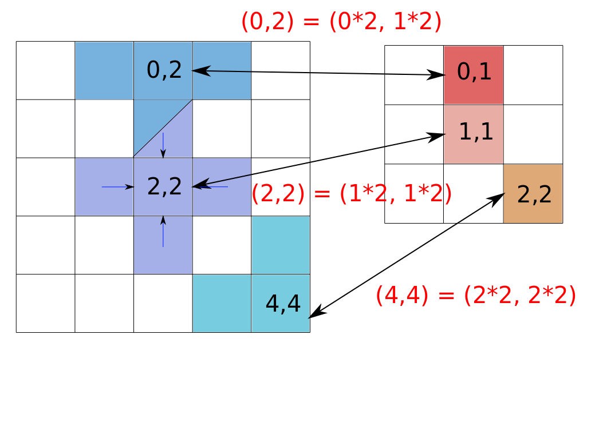

## Numpy array zamiast list

### Tworzenie tablic

### Dostęp do elementów tablicy wielowymiarowej

### Wycinki tablic za pomocą indeksów i masek

### Operacje matematyczne na całych tablicach

## Argumenty przekazywane z linii komend

## Operacje na plikach

## Podstawowe narzędzie obsługi systemu

## Rysowanie wykresów - podstawy biblioteki matplotlib

## Wykorzystywanie i tworzenie bibliotek

# Zadanie 1
W folderze ***resources/lab1/files*** zlokalizowanym się w repozytorium znajduje się szereg plików o losowych nazwach. W każdym z plików znajduje się tylko jeden wiersz o postaci: *location: [nazwa folderu]*, gdzie [nazwa folderu] może różnić się pomiędzy plikami. Należy skopiować poszczególne pliki zawarte w podanej lokalizacji do folderów, których nazwy są takie same jak ta podana wewnątrz pliku. 

 

Nowo utworzone foldery mogą zostać umieszczone w dowolnej lokalizacji. 

# Zadanie 2
Należy utworzyć funkcję która będzie potrafiła przeskalować macierz z większego rozmiaru na mniejszy. W tym celu:

1. Utwórz nowy plik pythona o nazwie matrix. 
2. Wewnątrz tego pliku przygotuj funkcję "reduce" która jako argumenty będzie przyjmowała obiekt reprezentujący listę/tablicę dwuwymiarową oraz rozmiar wynikowej macierzy (parametr określający rozmiar powinien obsługiwać sytuację gdy przekazano 1 liczbę lub parę)
3. Uzupełnij ciało funkcji wykorzystując algorytm opisany poniższym rysunkiem
 
Na powyższym rysunku oznaczono jak poszukiwać referencyjnych elementów w tablicy większej w zależności od indeksu elementu w tablicy mniejszej. Wartość kolejnych elementów w tablicy mniejszej powinna być obliczona jako średnia z zaznaczonych sąsiadów i referencyjnego elementu z tablicy większej. 

4. Zwróć wynikową tablicę/listę dwuwymiarową.


# Zadanie 3
Należy napisać skrypt który będzie wczytywał plik graficzny ***resources/lab1/meil.png***. 

 

Ponadto skrypt ten powinien przeskalować obraz do rozmiaru 20x20 (wykorzystaj funkcję z poprzedniego zadania) i wyświetlić w jednym oknie obraz wczytany i przeskalowany obok siebie.

### Podpowiedzi
- Obraz można wczytać za pomocą funkcji ***imread*** znajdującej się w bibliotece ***matplotlib.image***. Wczytany obraz będzie w postaci tablicy 3 wymiarowej, gdzie pierwsze 2 wymiary określają indeks pojedynczego punktu, a ostatni określa kanał (red, green, blue i opcjonalnie alpha)
- Aby utworzyć 2 wykresy/obrazki w jednym oknie zamiast funkcji ***figure*** (z biblioteki matplotlib.pyplot) należy skorzystać z funkcji ***subplot*** gdzie argumentami jest para określająca liczbę wykresów w wierszach i  kolumnach:

```python
import matplotlib.pyplot as plt
# kod wyznaczający tablice x, y ....
_, axes =  plt.subplot(1,2)
axes[0].plot(x, y)
axes[1].plot(y, x)
plt.show()
```

- Obraz zapisany w postaci macierzy kolorów RGB (lub RGBA) można wyświetlić za pomocą funkcji ***imshow*** znajdującej się w bibliotece ***matplotlib.pyplot*** (w przypadku rysowania w jednym oknie należy skorzystać z metody ***imshow*** należącej do obiektów typu Axes, zwracanych z funkcji subplot)

# Zadanie 4
Uzupełnij skrypt z poprzedniego zadania tak, aby na podstawie jasności obrazka w danym punkcie generował obraz w pliku tekstowym za pomocą wybranych znaków. Obraz tekstowy powinien zostać utworzony na bazie przeskalowanego, mniejszego obrazka oraz powinien używać co najmniej 2 różnych znaków do określenia 2 różnych jasności (np. "||" dla czarnego koloru i "--" dla szarego). Poniżej zamieszczono przykładowy rezultat.  
```python
                  - - -                 
            - - - - - - - - -           
        ||  - -           - - -         
      ||||        - ||        - - -     
    ||||||      ||||||  ||||    - -     
    ||||  ||||  ||      ||||||    - -   
  ||||    ||    ||      ||    ||    - - 
  ||||  ||      ||      ||    ||||  - - 
  ||    ||      ||      ||      ||  - - 
||||  - ||      ||      ||      ||    - 
||||  - ||    ||||||||  ||      ||    - 
||||    ||      ||      ||      ||    - 
  ||-   ||      ||      ||      ||  - - 
  ||||  ||||    ||      ||    ||||  - - 
  ||||    ||-   ||      ||  ||||    -   
    ||||    ||  ||      ||||||    - -   
    - ||||      ||      ||||    - -     
      ||||||                    -       
          ||||||||      ||||||          
            ||||||||||||||||-           
```
### Podpowiedzi
W celu określenia jasności obrazka w danym punkcie skorzystaj z definicji kolorów HSV zamiast RGB. Kolory HSV, podobnie jak RGB są przechowywane w macierzy o 3 kanałach. Definicja każdego z kanałów można zobaczyć na poniższym rysunku:

 

Konwrsji koloru z macierzy RGB na macierz HSV można dokonać za pomocą funkcji ***rgb_to_hsv*** znajdującej się w bibliotece ***matplotlib.colors***. Kanał  ***Value*** dla macierzy HSV jest określony jako trzeci(ostatni).


